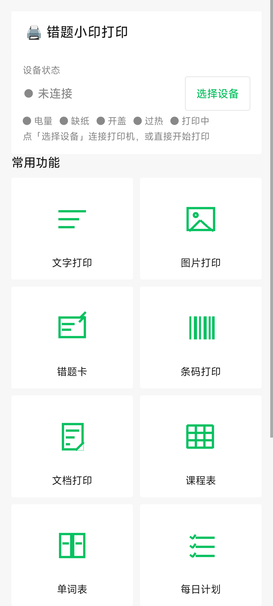
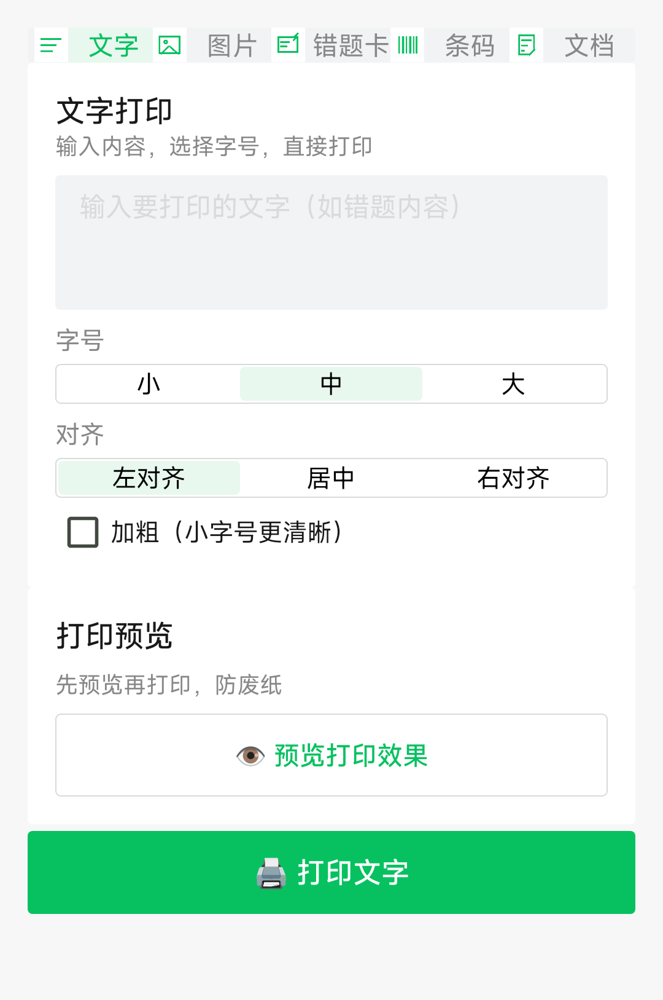
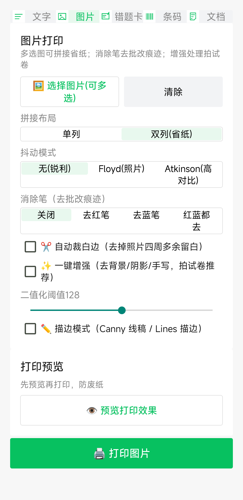
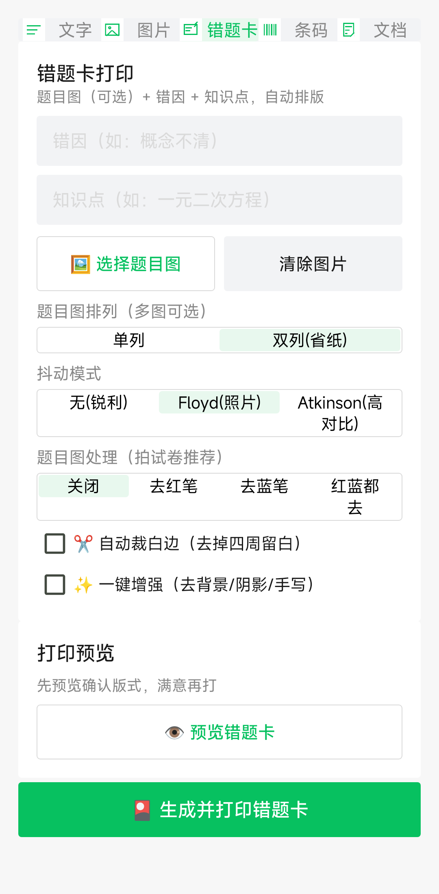
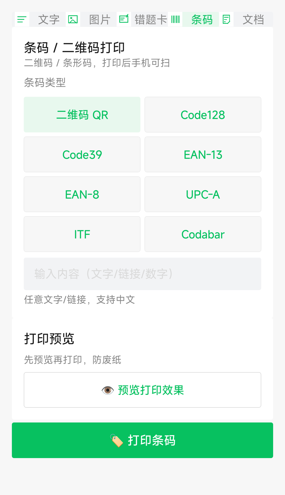
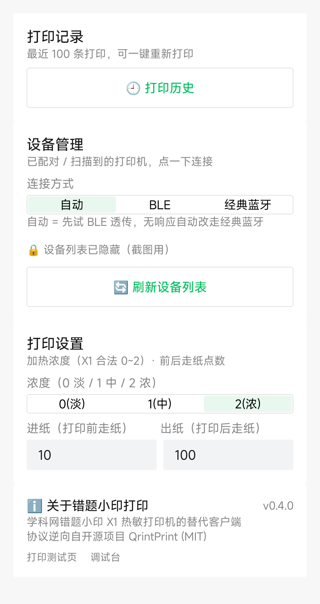

# 错题小印打印客户端（Qring Print Android）

学科网「错题小印」热敏打印机的**安卓替代客户端**。

官方 App 已下架、服务器已关闭，本客户端通过逆向蓝牙协议让打印机恢复可用。
支持 **BLE 透传 + 经典蓝牙 SPP 双通道**（自动探测），文字 / 图片 / 错题卡 /
条码 / 模板 / PDF / Word / Excel / TXT 全格式打印。

> 协议逆向参考自 [Thisko/QrintPrint](https://github.com/Thisko/QrintPrint)（MIT，HarmonyOS 版）：
> 官方 App `com.zxxk.xiaoyin.App` 私有协议已被其完整逆向并真机验证。
> 本工程在其基础上针对 **X1 机型** 验证、修正并重写了安卓客户端。

## 支持机型

- **X1（BLE 透传版）**——写 FF02 / 通知 FF01（ISSC 芯片），K80 真机实测通过
- **X1（经典蓝牙版）**——SPP（RFCOMM），AUTO 模式自动回退探测
- 理论上兼容 Qring/BeePrt BY 系列（协议同源），未逐一验证

## 下载 APK

最新版见 [Releases](https://github.com/kikyang/qring-print-android/releases)（v0.5.1，0.87MB，需 Android 13+）。
应用内「我的 → 关于 → 检查更新」可直接升级到新版本。

## 界面预览

| 首页 | 文字打印 | 图片打印 |
|---|---|---|
|  |  |  |

| 错题卡 | 条码打印 | 我的（设置/历史/设备） |
|---|---|---|
|  |  |  |

## 功能

### 打印（七入口，全部打印前自动预览确认，取消零耗纸）
- **文字打印**：字号（小/中/大）+ 加粗 + 左/中/右对齐
- **图片打印**：多选图、单列/双列拼接省纸；抖动三模式（无 / Floyd / Atkinson）；
  消除笔（去红/蓝笔批改）；自动裁白边；一键增强（Sauvola 自适应二值化）；
  **二值化阈值滑块**（黑白化阶段调"哪些算黑"，与打印浓度独立）；
  **描边模式**（Canny 线稿 / LINES 描边，灵敏度/线宽/平滑/反白可调，移植自 xyprt）
- **错题卡**：题目图（多图拼接 + 全套预处理）+ 错因 + 知识点 + 订正/举一反三手写区（练习本版式）
- **条码/二维码**：QR + 7 种一维码（Code128/Code39/EAN13/EAN8/UPC-A/ITF/Codabar），内容实时校验
- **文档打印**（零依赖）：PDF（系统 PdfRenderer 逐页渲染 + 自动裁白边）、
  Word（docx 文本提取 / 老格式 doc 的 OLE2 解析）、Excel（xlsx 表格 / 老格式 xls 的 BIFF8 字符串表）、
  TXT（GBK/UTF-8 自动识别）
- **常用模板 + 错题卡（「其它」Tab，v0.5.1 合并）**：课程表 / 单词表 / 每日计划 / 口算题
  一键生成打印，与错题卡统一收在打印页第 5 个 Tab
- **元素排版**（v0.5，合成自 bzhou830/snowboys/lztttt 三方画布概念；v0.5.1 并入图片页）：
  图片页「📐 排版」Dialog 打开，文字 / 图片 / 条码元素自由拖拽排版、缩放、置顶、
  可存为模板复用；完成后加入图片通道统一预览/打印（与「🖌 涂鸦」入口一致）
- **打印测试页**：浓度线 / 线条 / 灰阶渐变 / 文字（藏于「我的 → 关于」）

### 连接
- **双通道**：BLE 透传 + 经典蓝牙 SPP，自动模式先试 BLE 并用状态查询验证，
  无响应自动回退 SPP（覆盖 X1 各软件版本）；也可手动指定
- **连接进度对话框**：阶段文案 + 进度条实时反馈（AUTO 模式最坏约 40 秒不"像死机"），可取消

### 增强体验
- **机器状态灯**：主页五灯（电量/缺纸/开盖/过热/打印中）实时显示，10s 轮询
- **打印历史**：最近 100 条自动记录（无损光栅），一键重新打印
- **打印设置**：浓度（0~2）/ 进纸 / 出纸 可调，持久化保存
- 打印体检：开盖/缺纸/过热/低电量实时拦截
- **检查更新（OTA，v0.5，2026-08-12 移植 lztttt 8-11 修复版）**：
  藏于「我的 → 关于」，从 GitHub Releases 查最新版 → 下载 APK → 一键安装；
  版本号数字分段比较，下载手动跟随重定向
- 调试台（藏于「我的 → 关于」）：收发 hex 日志、原始命令

### UI
- **微信小程序风格**（灰底白卡 #F7F7F7/#FFFFFF、微信绿 #07C160、8px 圆角、线性图标），
  支持系统深色模式
- 底部三 Tab：首页（设备状态 + 9 宫格）/ 打印（文字/图片/错题卡/条码/文档二级切换）/ 我的（设置 + 历史 + 设备管理）

## 构建

环境：JDK 17 + Android SDK（compileSdk 34，minSdk 33）+ Gradle 8.7

```bash
cd android
gradle runUnitTests       # 单元测试（协议/抖动/边缘检测 + Robolectric 界面测试，共 35 例）
gradle assembleRelease    # 正式签名 release（R8 已开，APK ~0.9MB）
gradle assembleDebug      # 调试版（无 R8，~6.4MB）
```

### 测试覆盖（2026-08-12 建立）

- **协议层**（QringProtocolTest）：状态位解析、开盖/缺纸提示优先级、指令字节序、走纸/光栅头拆分
- **算法层**（DitherTest / CannyTest）：抖动密度统计、阈值语义、边缘检测边界
- **界面层**（MainActivityUiTest，Robolectric）：启动三 Tab、文字预览生成、画布加元素/拖拽、模板存取、关于页入口
- 首次跑 Robolectric 会自动下载 android-all 镜像（约 50MB，此后缓存）；蓝牙在 shadow 下为空实现
- 新增测试类后记得把类名加进 `app/build.gradle.kts` 的 `runUnitTests.args`

> 注意：工程路径含非 ASCII 字符时需在 `gradle.properties` 保留
> `android.overridePathCheck=true`。
>
> 单元测试用 `runUnitTests`（JavaExec 任务）而非默认 `testDebugUnitTest`：
> Gradle Test worker 的 @argfile 在 Windows 中文路径下 classpath 失效
> （转义后的 `\\` 路径加载不到类），JavaExec 直传 -cp 绕开（2026-08-12 实测根因）。
>
> R8 minify 于 2026-08-12 开启（AGP 8.2.2 → 8.5.2 以兼容 Gradle 8.7），
> APK 6.4MB → 0.87MB（-86%）；zxing 自带 consumer rules，mapping 已验证功能类全保留。

## 目录结构

```
错题小印打印机逆向/
├── android/               # 安卓客户端（Kotlin，本仓库主体）
│   └── app/src/main/java/com/qring/print/
│       ├── PrinterConnection.kt      # 连接通道抽象接口
│       ├── BlePrinterConnection.kt   # BLE 透传通道（FF02/FF01，X1 实测）
│       ├── SppPrinterConnection.kt   # 经典蓝牙 SPP 通道（兼容经典版固件）
│       ├── PrinterHolder.kt          # 双实例 + AUTO 探测分派
│       ├── QringProtocol.kt          # 私有协议层（命令/状态位/光栅头）
│       ├── RasterEncoder.kt          # 光栅编码/行合并/预览渲染
│       ├── Dither.kt                 # 抖动（无/Floyd/Atkinson）
│       ├── Canny.kt / Outline.kt     # 描边（Canny 边缘 / LINES 墨水对比度）
│       ├── Morphology.kt / Contrast.kt  # 形态学去噪 / 对比度调节
│       ├── ImageEnhancer.kt          # 一键增强/消除笔/自动裁白边
│       ├── PdfPrintRenderer.kt       # PDF → 384px 位图（系统 PdfRenderer）
│       ├── DocxTextExtractor.kt      # Word docx 纯文本提取（zip+XML）
│       ├── XlsxTextExtractor.kt      # Excel xlsx 表格提取（zip+XML）
│       ├── LegacyDocExtractor.kt     # 老格式 doc/xls（OLE2 解析）
│       ├── TemplateBuilder.kt        # 错题卡模板
│       ├── TemplateLibrary.kt        # 课程表/单词表/每日计划
│       ├── SelfTest.kt               # 打印测试页
│       ├── Design.kt                 # 微信风设计系统（含线性图标）
│       └── MainActivity.kt           # 三 Tab 主界面
├── docs/
│   ├── architecture.md   # 人类可读的架构说明（推荐先读）
│   ├── protocol.md       # 完整协议（指令表/状态位/时序/光栅编码）
│   └── 实物联调手册.md    # 联调操作手册
├── reference/qrintprint/ # QrintPrint 源码归档（MIT，仅参考）
└── 电脑端验证脚本见仓库 temp 说明（BLE 扫描/打印/协议核对）
```

## 关键协议要点（X1 实测）

- 查询：状态 `10 FF 40`、电量 `10 FF 50 F1`、设备信息 `10 FF 70`
  （`设备名|MAC|MAC|固件版本|SN|电量`）、固件 `10 FF 20 F1`
- 浓度合法范围 **0~2**（3/4 报 ER），定稿 2
- 光栅 `GS v 0`：m=1 有 0x00 字节 bug 勿用；m=2 是标准双倍高
  （配合行合并实现黑度提升 + 不变形）；m=3 双倍宽有超出打印头风险
- **不要发 ENABLE2（1F B2 10）**：X1 固件不识别，会被文本引擎渲染成「固」字乱码
- 发送节奏：BLE 分包 32B + 无确认写 + 80ms 间隔（快速写会丢包）；
  SPP 分包 1024B + 1ms
- 完整细节见 `docs/protocol.md`

## 免责声明

- 本软件仅供学习与个人使用；逆向对象为本人合法拥有的设备
- 官方 App 与服务器已不可用，本项目与学科网无任何关联
- 使用风险自行承担，勿用于商业分发

## 致谢

- [Thisko/QrintPrint](https://github.com/Thisko/QrintPrint) —— 协议逆向的起点（MIT）
- [snowboys/QrintPrint-Windows](https://github.com/snowboys/QrintPrint-Windows) —— 同类项目参考
- [soulxyz/xyprt_android](https://github.com/soulxyz/xyprt_android) —— Canny/LINES 描边、PDF 打印方案参考
- [lztttt/QrintPrint-Android](https://github.com/lztttt/QrintPrint-Android) —— 口算/涂鸦/OTA 更新参考
- [bzhou830/QringPrint](https://github.com/bzhou830/QringPrint) —— 自定义画布概念参考（uniapp）
