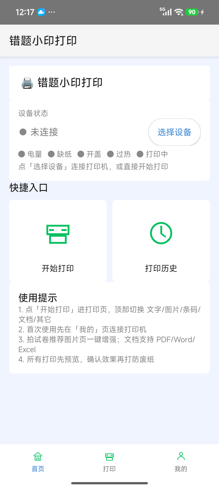
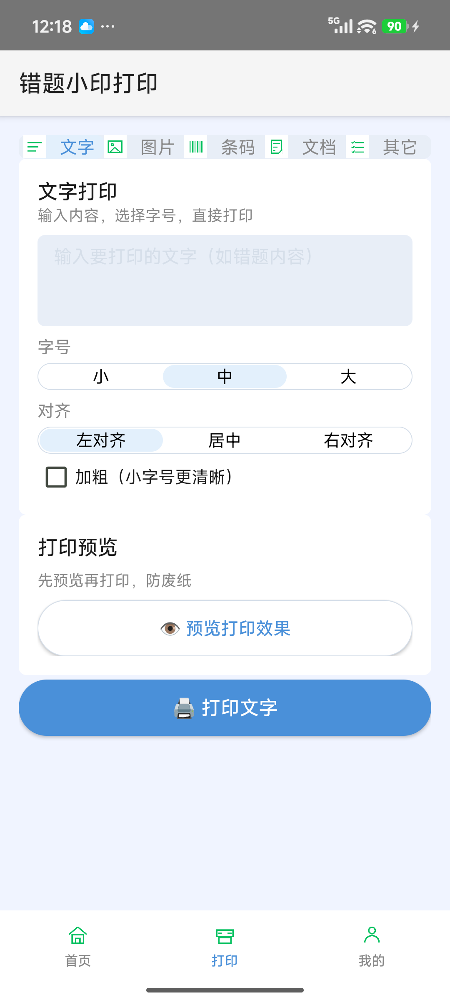
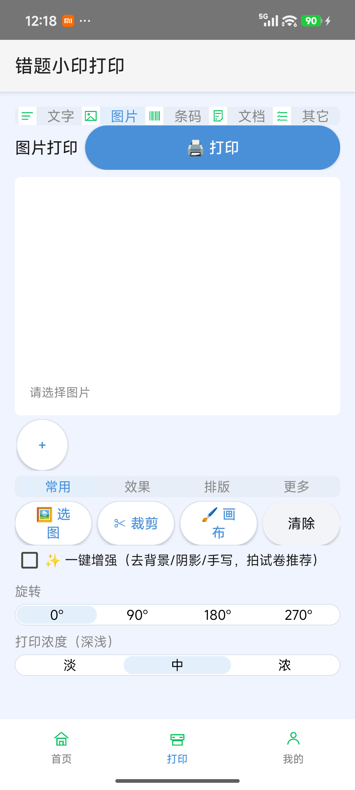
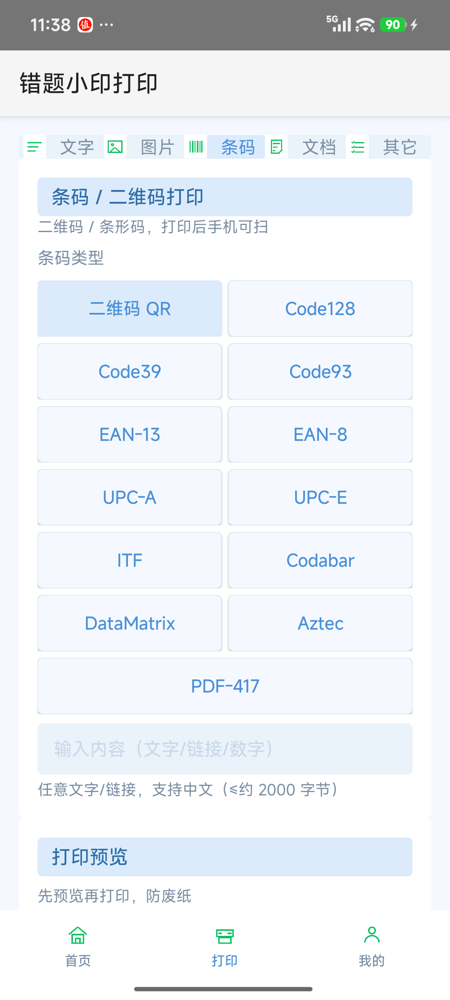
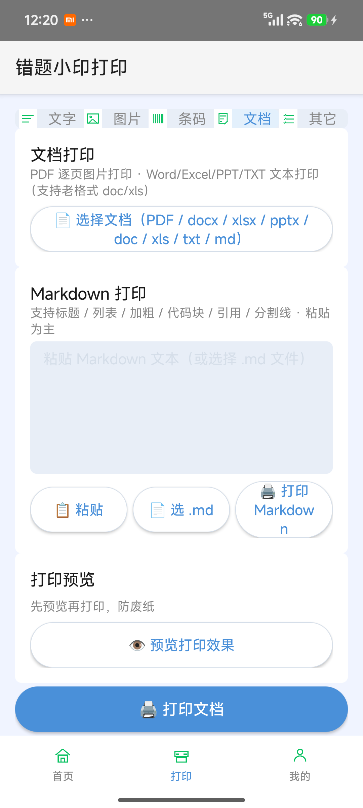
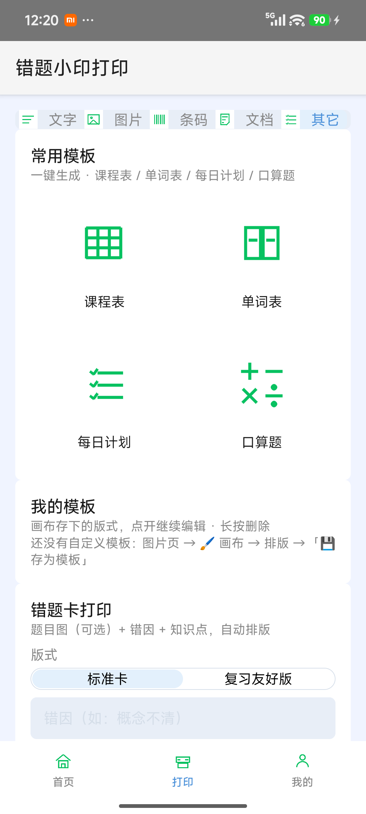
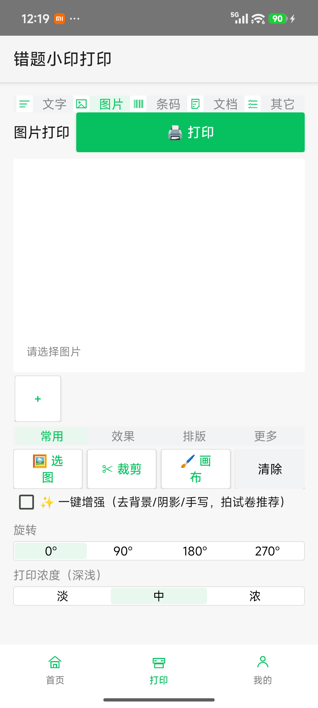
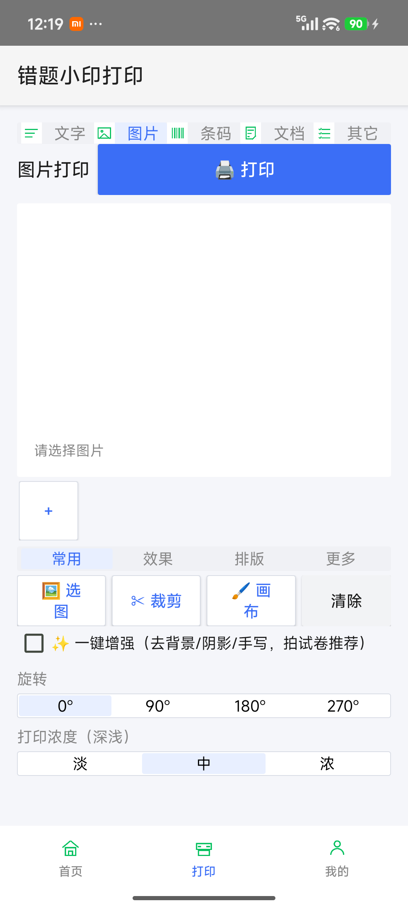

# 错题小印打印客户端（Qring Print Android）

学科网「错题小印」热敏打印机的**安卓替代客户端**。

官方 App 已下架、服务器已关闭，本客户端通过逆向蓝牙协议让打印机恢复可用。
支持 **BLE 透传 + 经典蓝牙 SPP 双通道**（自动探测，默认 **SPP 优先**、BLE 兜底），
文字 / 图片 / 错题卡 / 条码 / 模板 / PDF / Word / Excel / TXT 全格式打印。

> 协议逆向参考自 [Thisko/QrintPrint](https://github.com/Thisko/QrintPrint)（MIT，HarmonyOS 版）：
> 官方 App `com.zxxk.xiaoyin.App` 私有协议已被其完整逆向并真机验证。
> 本工程在其基础上针对 **X1 机型** 验证、修正并重写了安卓客户端。

## 支持机型

- **X1（本机 Qring_B8EA 实测双通道都通）**——SPP（RFCOMM）+ BLE 透传
  （写 FF02 / 通知 FF01，ISSC 芯片）；AUTO 默认 **SPP 优先**（快 + 墨色深 +
  查询可响应），SPP 连接失败回退 BLE
- **X1（经典蓝牙版）**——SPP（RFCOMM）
- 理论上兼容 Qring/BeePrt BY 系列（协议同源），未逐一验证

## 下载 APK

最新版见 [Releases](https://github.com/kikyang/qring-print-android/releases)（v0.7.5，约 1.0MB，需 Android 13+）。
应用内「我的 → 关于 → 检查更新」可直接升级到新版本（检查走 jsDelivr，国内网络可用；
发版后 2-3 小时内新版可能尚未被收录，属正常延迟）。

## 更新日志

- **v0.7.5（2026-09-01）**：**条码扩至 13 种 + 输入清洗/校验位重算**——条码从 QR + 7 种一维码
  扩到 zxing 可写全部 **13 种**（新增 Code93 / UPC-E / DataMatrix / Aztec / PDF-417）；条码输入清洗
  （EAN/UPC 仅留数字并核验 mod-10 校验位、ITF 奇数自动补前导 0、Code39/93 转大写、Codabar 去空白）
  + 校验位重算；上游巡检降为一周一次；198 例测试全过
- **v0.7.4（2026-08-27）**：**变量数据批量打印 + 函数图像 + 错题卡入模板 + 统一确认条**——
  批量打印支持导入 CSV/Excel，用 `{{列名}}` 占位符套模板整表一次打完；文档新增函数图像
  （输入表达式如 `x^2-3` 生成坐标图）；错题卡并入常用模板宫格；打印确认条统一
  （份数/打印浓度/前后走纸）；横版照片选入自动提示一键旋转 90°；支持系统「分享图片」直达打印；
  图片工作台新增拍照入口；重做 xyprt 简洁风 / 喵喵机蓝白风两主题；189 例测试全过，
  R8 release APK 1.0MB
- **v0.7.3（2026-08-18）**：**三种界面主题差异化**——微信风（灰底白卡/绿/方角）、xyprt 简洁风（浅蓝/小圆角）、喵喵机蓝白风（蓝白/胶囊按钮）；按钮、圆角、选中态随主题变化，不再只是换色
- **v0.7.2（2026-08-18）**：**图片工作台 + 裁剪 + PPT + 公式排版 + 多份打印 + 多主题**——
  图片页重构为全屏实时预览工作台；新增手动裁剪；文档支持 PPT 导入与 Word 公式/排版；
  打印支持多份；我的页可切换微信风 / xyprt 简洁风 / 仿喵喵机蓝白风；142 例测试全过
- **v0.7.1（2026-08-18）**：**OTA 升级后新增更新说明弹窗**——升级后首次启动会展示本次更新说明，
  支持跨版本收集更新日志（跳版本也能看到）；137 例测试全过，R8 release APK 0.90MB
- **v0.7.0（2026-08-16）**：**Markdown 打印 + 照片旋转/缩放 + 高分辨率增强**——
  文档 Tab 新增 Markdown 打印（自写 parser/renderer，零依赖）；图片页新增旋转 0/90/180/270
  与缩放 50%~200%；「一键增强」升级为高分辨率光照补偿后再缩放二值化（小字不糊），
  高级设置可选 Sauvola/Wolf/Bradley 三种算法与弱/标准/强三档强度；132 例测试全过，
  R8 release APK 0.90MB
- **v0.6.3（2026-08-13）**：**修复 OTA 更新最后一步无权限安装**——Android 13+ 装 APK 需
  `REQUEST_INSTALL_PACKAGES` 权限 + 用户授权「允许安装未知应用」；manifest 补权限，未授权时
  自动跳系统设置页引导，首次授权后免重复授权。⚠️ **0.6.1/0.6.2 存量用户**升级到 0.6.3 的
  这唯一一次需手动授权（旧包未带权限声明，弹不出引导）：设置 → 应用管理 → 错题小印打印 →
  权限 → 安装未知应用 → 允许，之后更新全自动引导
- **v0.6.2（2026-08-13）**：**连接固定 SPP 直连**——弃用 AUTO（SPP 失败时静默回退 BLE，
  用户无感知但打印慢、墨色淡，是条码发淡的根因）；已连接状态显示**真实通道**
  （SPP/BLE，替换误导的「蓝牙版本 BLE」）；修正扫描列表「（BLE 直接连接）」硬编码字样。
  99 例测试全过
- **v0.6.1（2026-08-13）**：**修复 OTA 检查更新失败**——release 包缺 INTERNET 权限
  （AGP debug 构建自动注入该权限、release 不注入，导致 release 版全部网络请求被拒，
  弹「检查更新失败：网络异常」；蓝牙打印不需要 INTERNET 故平时未暴露。手机实测
  「已是最新版本」验证通过）；UpdateManager 加日志便于以后诊断
- **v0.6.0（2026-08-13）**：SPP 提速——光栅块间延迟 150ms→**0ms**（150ms 是打印时间
  瓶颈，一页省约 750ms，实测 30/0ms 墨色更实）；AUTO 连接 **SPP 优先 / BLE 兜底**，
  BLE 入口藏进调试台；**功能减法整合 6 条**（历史"再编辑"、参数按内容类型记忆、
  图片页参数分层 + 去专业说法、统一画布含涂鸦、模板系统打通、首页与打印页分工）；
  虚拟打印机端到端仿真（FakePrinter 协议引擎）；**99 例测试全过**；README 补
  X1 实测坑记录（固字机制与三上游核对 / SPP 浓度有效性 / 开头缺色电流限制假象 /
  浓度命令无响应属正常）
- **v0.5.5（2026-08-12）**：OTA 检查源顺序定案（jsDelivr data API 主源、
  @main/version.json fallback）；R8 瘦身 APK 6.4MB → 0.87MB
- **v0.5.4（2026-08-12）**：OTA 检查改 version.json 主源（data API tag 索引滞后不可靠）
- **v0.5.3（2026-08-12）**：修复「其它」Tab 无图标 + 模板区改图标宫格
- **v0.5.2（2026-08-12）**：APK 入仓库 releases/，OTA 经 jsDelivr CDN 拉取
- **v0.5.1（2026-08-12）**：文档 Tab 合并进「其它」Tab
- **v0.5.0（2026-08-12）**：错题卡模板 + 元素排版画布（文字/图片/条码拖拽）
- **v0.4.x（2026-08-11）**：功能实测联调闭环（文字/图片/错题卡/条码/PDF/自检页/浓度校准），
  BLE 分包 96B/40ms 定稿，X1 设备信息解析

## 界面预览

| 首页（启动台） | 文字打印 | 图片工作台 |
|---|---|---|
|  |  |  |

| 条码打印 | 文档打印 | 其它（模板/错题卡） |
|---|---|---|
|  |  |  |

### 三种界面主题（v0.7.3 起，按钮/圆角/选中态随主题变化）

| 微信风 | xyprt 简洁风 | 喵喵机蓝白风 |
|---|---|---|
|  |  |  |

> 截图取自 Android 13（小米 24122RKC7C），内容为默认空状态；为避免泄露个人设备信息，「我的」页（含蓝牙配对列表 / MAC 地址）不放预览。

## 功能

打印页顶部 **5 个二级 Tab**：文字 / 图片 / 条码 / 文档 / 其它（全部打印前自动预览确认，取消零耗纸）。

### 打印
- **文字打印**（Tab 1）：字号（小/中/大）+ 加粗 + 左/中/右对齐
- **图片打印**（Tab 2，v0.7.2 图片工作台）：全屏实时预览 + 多图缩略图条 + 单图编辑；
  支持手动裁剪（自由/1:1/3:4/4:3）、旋转、缩放、删除；多图单列/双列拼接省纸；
  抖动三模式（清晰/细腻/高对比）；一键增强（Sauvola 自适应二值化，去背景/阴影/手写）；
  打印浓度（淡/中/浓，就近可调）；消除笔去批改、自动裁白边、黑白深浅、线稿模式；
  统一画布 **🖌 画布**（涂鸦/文字/图片/条码自由排版）
- **条码/二维码**（Tab 3）：**13 种码制**（QR / Code128 / Code39 / Code93 / EAN-13 / EAN-8 / UPC-A / UPC-E / ITF / Codabar / DataMatrix / Aztec / PDF-417），含 EAN-UPC 校验位重算、ITF 奇数自动补位、Code39/93 转大写、Codabar 去空白等输入清洗；内容实时校验
- **文档打印**（Tab 4，零依赖）：PDF（系统 PdfRenderer 逐页渲染 + 自动裁白边）、
  Word（docx 文本提取 + OMML 公式排版 / 老格式 doc 的 OLE2 解析）、Excel（xlsx 表格 / 老格式 xls 的 BIFF8 字符串表）、
  PPT（pptx 文本提取）、TXT（GBK/UTF-8 自动识别）
- **其它**（Tab 5，v0.5.1 合并，v0.6 模板系统打通）：
  - **常用模板宫格**（图标宫格，v0.7.4 扩容）：课程表 / 单词表 / 每日计划 / 口算题 / **批量打印 / 函数图像 / 错题卡 / 错题卡·复习**，内置 JSON 注册表（SystemTemplates）数据驱动，一键生成打印
    - **批量打印**：导入 CSV / Excel，用 `{{列名}}` 占位符套模板整表一次打完，可开递增流水号 `{{序号}}`
    - **函数图像**：输入表达式（如 `x^2-3`）生成坐标图打印
  - **我的模板宫格**：画布存下的版式（缩略图预览 + 点击进画布继续编辑 + 长按删除），与常用模板同款视觉
  - **错题卡**：题目图（多图拼接 + 全套预处理）+ 错因 + 知识点 + 版式可选（标准卡 / 复习友好版），
    订正/举一反三手写区（复习友好版进度栏 + 撕纸线 + 订正区）
- **统一画布**（v0.5 元素排版 + v0.6 涂鸦合流）：文字 / 图片 / 条码 / 涂鸦笔画元素自由拖拽排版、缩放、
  置顶，可存为模板复用（图片元素随画布打印但不随模板持久化；笔画随模板持久化）
- **打印测试页**：浓度线 / 线条 / 灰阶渐变 / 文字（藏于「我的 → 关于」）

### 连接
- **主力 SPP**（2026-08-13 定案）：BLE 打印效果比 SPP 差（传输慢、墨色偏淡），
  故连接方式只保留经典蓝牙（自动 = SPP 优先、连不上自动回退 BLE 兜底），
  **BLE 连接入口藏进「关于 → 调试台」**（供扫档/诊断用，见调试台 BLE 连接）。
  SPP 实测：传输快 1024B/1ms、同浓度墨色更深、查询也可响应
- 切通道自动先断开当前连接（打印机单连接约束）
- **连接进度对话框**：阶段文案 + 进度条实时反馈（AUTO 模式最坏约 40 秒不"像死机"），可取消

### 增强体验
- **机器状态灯**：主页五灯（电量/缺纸/开盖/过热/打印中）实时显示，10s 轮询
- **打印历史**：最近 100 条自动记录（无损光栅），一键重新打印
- **打印设置**：浓度（0~2）/ 进纸 / 出纸 可调，持久化保存
- 打印体检：开盖/缺纸/过热/低电量实时拦截
- **检查更新（OTA，v0.5.2 起走 jsDelivr）**：藏于「我的 → 关于」，
  检查源 = jsDelivr data API（主）+ version.json（fallback），下载 = jsDelivr CDN @tag 路径
  → 一键安装；版本号数字分段比较，下载手动跟随重定向（国内网络可用，发版后 2-3h 收录延迟属正常）
- 调试台（藏于「我的 → 关于」）：收发 hex 日志、原始命令

### UI
- **三种界面主题可选**（v0.7.3 起差异化）：微信风 / xyprt 简洁风 / 喵喵机蓝白风，
  按钮、圆角、选中态随主题变化，不再只是换色
- 微信小程序风格（灰底白卡 #F7F7F7/#FFFFFF、微信绿 #07C160、8px 圆角、线性图标），
  支持系统深色模式
- 底部三 Tab：首页（设备状态 + 快捷入口：开始打印 / 打印历史 + 使用提示，v0.6 分工）/
  打印（文字/图片/条码/文档/其它二级切换）/ 我的（设置 + 历史 + 设备管理）

## 构建

环境：JDK 17 + Android SDK（compileSdk 34，minSdk 33）+ Gradle 8.7

```bash
cd android
gradle runUnitTests       # 单元测试（协议/算法/界面/虚拟打印机端到端 + 性能基准，共 198 例）
gradle assembleRelease    # 正式签名 release（R8 已开，APK ~1.0MB）
gradle assembleDebug      # 调试版（无 R8，~6.4MB）
```

### 测试覆盖（2026-08-12 建立，**2026-09-01 全量 198 例**）

> 下列为分批补充的测试类（合计 198 例）；新增测试类后记得把类名加进 `app/build.gradle.kts` 的 `runUnitTests.args`。

- **协议层**（QringProtocolTest，15 例）：状态位解析、开盖/缺纸提示优先级、指令字节序、走纸/光栅头拆分
- **算法层**（DitherTest / CannyTest，13 例）：抖动密度统计、阈值语义、边缘检测边界
- **界面层**（MainActivityUiTest，19 例，Robolectric）：启动三 Tab 与五功能块、图标文件断言、
  文字预览生成、排版 Dialog 加元素、渲染、模板存取、我的页入口、图片页参数记忆/高级折叠、
  画布涂鸦笔画、系统模板 JSON 注册表、我的模板宫格（缩略图/点击进画布/无模板引导）、
  首页与打印页分工
- **虚拟打印机引擎**（FakePrinterTest，21 例）：协议应答仿真器的字节流状态机——
  查询应答、光栅解析（任意分包边界）、故障注入、坏头校验、未知字节容错
- **端到端链路**（FakePrinterE2ETest，15 例）：连接 → 探测 → 唤醒 → 体检 → 光栅分包 →
  状态拦截整条链路在 JVM 跑真代码；含 AUTO 探测（2026-08-13 反转：**SPP 优先回退 BLE**）、
  SPP 单向（查询无响应）路径、**切通道先断开另一通道**（打印机单连接约束）、
  缺纸/开盖/打印中故障帧、ACK 超时。打印时序抽取为 PrintJobRunner，
  BLE/SPP/Fake 三通道共享同一份代码——**实物联调只剩 GATT 写特征 + 热敏头物理
  两个未知量**
- **性能基准**（ImagePipelineBenchTest，3 例，JVM 参考值见下节）
- **后续新增**（v0.7.x 分批补充，合计 198 例）：图片增强/变换/裁剪（ImageEnhancerTest / ImageTransformTest）、
  Markdown 打印（MarkdownParserTest / MarkdownRendererTest）、PPT 导入与 Word 公式排版（MathLayoutTest）、
  批量打印（CsvTableParserTest / XlsxTableExtractorTest / BatchTemplateTest）、函数图像
  （ExpressionEvaluatorTest / FunctionGraphTest）、OTA 更新说明（ReleaseNotesTest）、
  条码 13 种与校验/清洗（BarcodeGeneratorTest）
- 首次跑 Robolectric 会自动下载 android-all 镜像（约 150MB，此后缓存于 ~/.robolectric）；
  蓝牙在 shadow 下为空实现

### 图像管线性能基准（2026-08-13 实测，JVM 参考值）

同一份 Kotlin 逐像素代码在 JVM 与 ART 上数量级相当；下表中位数（3 次取样）。

| 场景 | NONE | Floyd-Steinberg | Atkinson |
|---|---|---|---|
| 1M 像素方图（1000×1000）抖动 | 4.0 ms | 14.3 ms | 14.8 ms |
| 1M 像素方图 抖动+打包 | 1.8 ms | 9.0 ms | 9.8 ms |
| 384 宽长图（384×2604 ≈ 1M）抖动 | 0.6 ms | 8.1 ms | 5.8 ms |
| 384×10000 长文档（3.84M）抖动 | 2.0 ms | 28.5 ms | 22.1 ms |

结论：**无需优化**（原计划的 IntArray 定点化/分块并行搁置）。图像处理远快于
BLE 传输：1M 像素光栅 ≈ 125KB 数据，按 32B/包 × 80ms 节奏传输需 ~5 分钟，
处理仅 ~14ms——瓶颈在无线传输，不在像素循环。真机若遇抖动卡顿，
首查 BLE 分包节奏而非算法。

> 注意：工程路径含非 ASCII 字符时需在 `gradle.properties` 保留
> `android.overridePathCheck=true`。
>
> 单元测试用 `runUnitTests`（JavaExec 任务）而非默认 `testDebugUnitTest`：
> Gradle Test worker 的 @argfile 在 Windows 中文路径下 classpath 失效
> （转义后的 `\\` 路径加载不到类），JavaExec 直传 -cp 绕开（2026-08-12 实测根因）。
>
> R8 minify 于 2026-08-12 开启（AGP 8.2.2 → 8.5.2 以兼容 Gradle 8.7），
> APK 6.4MB → 0.87MB（-86%）；zxing 自带 consumer rules，mapping 已验证功能类全保留。

## 目录结构

```
错题小印打印机逆向/
├── android/               # 安卓客户端（Kotlin，本仓库主体）
│   └── app/src/main/java/com/qring/print/
│       ├── PrinterConnection.kt      # 连接通道抽象接口
│       ├── PrintJobRunner.kt         # 打印时序编排（BLE/SPP/Fake 三通道共享）
│       ├── BlePrinterConnection.kt   # BLE 透传通道（FF02/FF01，X1 实测）
│       ├── SppPrinterConnection.kt   # 经典蓝牙 SPP 通道（兼容经典版固件）
│       ├── FakePrinter.kt            # 虚拟打印机协议引擎（测试/联调仿真）
│       ├── FakePrinterConnection.kt  # 虚拟打印机连接（PrinterConnection 实现）
│       ├── PrinterHolder.kt          # 双实例 + AUTO 探测分派 + 测试注入
│       ├── QringProtocol.kt          # 私有协议层（命令/状态位/光栅头）
│       ├── RasterEncoder.kt          # 光栅编码/行合并/预览渲染
│       ├── Dither.kt                 # 抖动（无/Floyd/Atkinson）
│       ├── Canny.kt / Outline.kt     # 描边（Canny 边缘 / LINES 墨水对比度）
│       ├── Morphology.kt / Contrast.kt  # 形态学去噪 / 对比度调节
│       ├── ImageEnhancer.kt          # 一键增强/消除笔/自动裁白边
│       ├── PdfPrintRenderer.kt       # PDF → 384px 位图（系统 PdfRenderer）
│       ├── DocxTextExtractor.kt      # Word docx 纯文本提取（zip+XML）
│       ├── XlsxTextExtractor.kt      # Excel xlsx 表格提取（zip+XML）
│       ├── LegacyDocExtractor.kt     # 老格式 doc/xls（OLE2 解析）
│       ├── TemplateBuilder.kt        # 错题卡模板
│       ├── TemplateLibrary.kt        # 课程表/单词表/每日计划
│       ├── SystemTemplates.kt        # 系统模板内置 JSON 注册表（v0.6 数据驱动）
│       ├── MathWorksheet.kt          # 口算题生成（借鉴 lztttt）
│       ├── CanvasEditor.kt           # 元素排版：元素模型/384 宽渲染/模板 JSON 存取（含涂鸦笔画）
│       ├── CanvasLayout.kt           # 元素排版：拖拽/命中/缩放/置顶/涂鸦模式
│       ├── UpdateManager.kt          # OTA 检查更新（jsDelivr + GitHub fallback）
│       ├── SelfTest.kt               # 打印测试页
│       ├── BarcodeGenerator.kt       # 条码/二维码（zxing，QR + 7 种一维码）
│       ├── PrintLog.kt               # 日志：内存环形缓冲 + 关键事件落盘
│       ├── HistoryStore.kt / HistoryActivity.kt  # 打印历史（无损光栅重打）
│       ├── Settings.kt               # 打印设置持久化（浓度/走纸/阈值等）
│       ├── DebugActivity.kt          # 调试台（收发 hex 日志/原始命令）
│       ├── Design.kt                 # 微信风设计系统（含线性图标）
│       └── MainActivity.kt           # 三 Tab 主界面
│   └── app/src/test/java/com/qring/print/  # 99 例测试
│       ├── QringProtocolTest.kt      # 协议字节/状态位/指令构造（15 例）
│       ├── DitherTest.kt / CannyTest.kt  # 抖动/边缘检测算法（13 例）
│       ├── TemplateBuilderTest.kt / HistoryStoreTest.kt / SettingsTest.kt
│       ├── MainActivityUiTest.kt     # Robolectric 界面测试（19 例）
│       ├── FakePrinterTest.kt        # 虚拟打印机协议引擎（21 例）
│       ├── FakePrinterE2ETest.kt     # 端到端链路（15 例）
│       └── ImagePipelineBenchTest.kt # 图像管线性能基准（3 例）
├── docs/
│   ├── architecture.md   # 人类可读的架构说明（推荐先读）
│   ├── protocol.md       # 完整协议（指令表/状态位/时序/光栅编码）
│   ├── recon.md          # 逆向调研笔记
│   ├── upstream-audit-2026-08-12.md / -13.md  # 上游三项目源码审计
│   ├── 实物联调手册.md    # 联调操作手册
│   └── 待办事项清单.md    # 项目四象限待办
├── reference/qrintprint/ # QrintPrint 源码归档（MIT，仅参考）
├── releases/             # 正式签名 APK（OTA 下载源）
├── screenshots/          # 界面预览截图
├── client/               # 电脑端替代客户端（规划中）
├── dev-log/              # 开发日志（按日）
├── temp/                 # 验证脚本/截图等临时产物（不入库）
└── version.json          # OTA 版本清单
```

## 关键协议要点（X1 实测）

- 查询：状态 `10 FF 40`、电量 `10 FF 50 F1`、设备信息 `10 FF 70`
  （`设备名|MAC|MAC|固件版本|SN|电量`）、固件 `10 FF 20 F1`
- 浓度合法范围 **0~2**（3/4 报 ER），定稿 2
- 光栅 `GS v 0`：m=1 有 0x00 字节 bug 勿用；m=2 是标准双倍高
  （配合行合并实现黑度提升 + 不变形）；m=3 双倍宽有超出打印头风险
- **不要发 ENABLE2（1F B2 10）**：X1 固件不识别，会被文本引擎渲染成「固」字乱码
  （2026-08-13 **SPP 通道 A/B 对照坐实**：段A 发 ENABLE2 多出「固」字、段B 正常，
  两通道一致，任何通道禁发）
- **光栅单块行数上限约 255 行**（2026-08-13 PC SPP 实测：200 行整发干净、400 行整发
  满纸「固」字、BLE 256 行「固字瀑布」同因）。PrintJobRunner 固定 **64 行分块**
  （64 ≪ 255，两通道安全），无需整发 / 通道差异化

> **「固」字机制 + 为啥上游没人遇到**（2026-08-13 三上游源码核对：qrintprint 鸿蒙 /
> lztttt Android / snowboys Windows）：X1 固件文本引擎对非法字节渲染「固」占位符。
> 两触发源——① ENABLE2 进解析流即渲染（连发/间隔发都坐实）；② 光栅单块 >~255 行
> 状态机错乱回落文本引擎。**三个上游项目全发 ENABLE2、光栅全整发不分块**，即两个触发源
> 全踩中：打印开头每张都出「固」字（落留白区没人看）、打 >255 行长图必瀑布
> （顶部正常底部一堆固字 → 被误判为纸/机器问题，无人报 issue）。铁证：lztttt 作者
> 在 CanvasDocument.kt 记过"打出来是一堆乱码"，但归因成 16 位高度回绕、设 4000 上限，
> 拦不住 ~255 行真因。本客户端 64 行分块 + 禁 ENABLE2，比上游更稳。
- 发送节奏：BLE 分包 **96B + 无确认写 + 40ms 间隔**（2026-08-13 手机扫档定稿：
  96B 稳定、128B 卡死；比旧基线 32B/80ms 快 6 倍。调试台可扫档覆盖复测）；
  SPP 分包 1024B + 1ms
- **SPP 光栅块间延迟 0ms**（2026-08-13 PC 阶梯实测：150/30/0ms 三档均内容完整，
  30/0ms 更清晰——传输快→行间隔短→残热积累墨色更实）。**150ms 块间 delay 是打印
  时间瓶颈**（384 行页 ~750ms，占打印耗时 ~98%），传输层 1024B/1ms 早已不是瓶颈。
  PrintJobRunner 块间延迟改为通道参数：SPP 0ms、BLE 150ms（BLE 传输慢需等待）
- **SPP 比 BLE 更快更黑**（2026-08-13 实测）：SPP 快 → 行间隔短 → 打印头残热
  积累 → 同浓度下墨色更深更实（非纸的问题）；BLE 行间隔长散热充分偏淡。
  浓度定稿 2 为 BLE 观感，走 SPP 嫌黑可调淡到 1（打印设置可调）
- **SPP 0ms 下浓度仍有效**（2026-08-13 PC 实测，50% 密度棋盘三档对照）：0/1/2
  三档可见差异——**0 偏淡像缺色（不建议）、1 适中、2 浓**。SPP 打太黑 → 浓度调 1
  即明显变浅；内容层面再用黑白深浅（阈值）/对比度调黑白分布（与墨深正交，均照常生效）
- **浓度命令无响应是正常的**：`10 FF 10 00 N` 是**设置类命令**（同 ENABLE/STOP/唤醒），
  固件不回 ACK；只有查询类（`10 FF 40/50/70`）才有回复。浓度生效与否**看打印效果**，
  不看命令回复
- **开头缺色 ≠ 冷启动**（2026-08-13 实测澄清）：测试图案若带「粗黑边界」开头会缺色，
  这是**全黑块触发固件电流限制**（黑度上不去）的假象，不是打印头冷启动。protocol.md
  无预热条记录：文字不打预热本来就黑、全黑块打不打预热都不黑。**测试图案勿用全黑块**
  （制造缺色假象）。用户实测确认**不做预热条**（预热条会造成顶部白黑条怪象——光栅头
  紧跟 ESC@ 被文本引擎吞字节的时序 bug）；要更黑直接靠浓度加深（实际内容黑更直接，
  非前面加黑条）
- **SPP 查询实测可响应**（10 FF 40/50/70 正常返回）——早期"单向、查询无响应"
  结论系 BLE 占用时连接失败的假象；AUTO 默认 SPP 优先、BLE 兜底
- 完整细节见 `docs/protocol.md`

## 免责声明

- 本软件仅供学习与个人使用；逆向对象为本人合法拥有的设备
- 官方 App 与服务器已不可用，本项目与学科网无任何关联
- 使用风险自行承担，勿用于商业分发

## 致谢

- [Thisko/QrintPrint](https://github.com/Thisko/QrintPrint) —— 协议逆向的起点（MIT）
- [snowboys/QrintPrint-Windows](https://github.com/snowboys/QrintPrint-Windows) —— 同类项目参考
- [soulxyz/xyprt_android](https://github.com/soulxyz/xyprt_android) —— Canny/LINES 描边、PDF 打印方案参考
- [lztttt/QrintPrint-Android](https://github.com/lztttt/QrintPrint-Android) —— 口算/涂鸦/OTA 更新参考
- [bzhou830/QringPrint](https://github.com/bzhou830/QringPrint) —— 自定义画布概念参考（uniapp）
